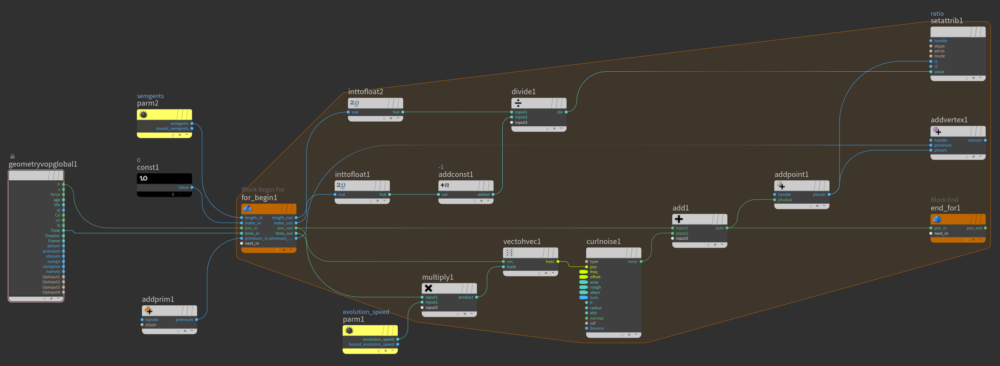
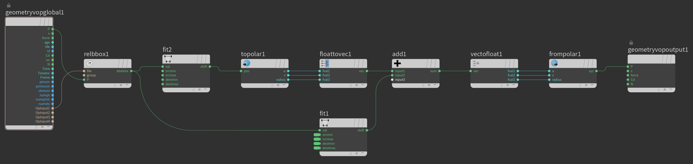

   
  
  
  

#  Polar Trail
[//]: <> (This is also a comment.):
//I share my personal projects for free with everyone. You are welcome to exlore all of the [here](https://github.com/nitzan-treg/community_projects.git).

this project is a part of a series of free projects im releasing for free for everyone
This is an experiment with curves and polar coordinates, I tried to create an interesting animation by animating the U, V, or Radius components of the Polar Coordinates

The curves were created in a for() loop inside Point VOP, in every loop, each point would sample a Curl noise, add it to its current position and add a new point in said position.

Afterward, I would normalize the Position attribute, convert it to polar coordinates, add the world and polar position together, while animating the world position. 

Full Node Tree:

