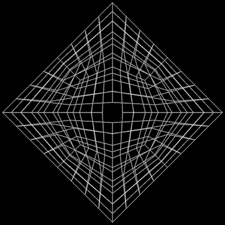

#  Davidope III
This project is very much inspired by davidope's art

It's an experiment, what happens when you rotate a position vector after you convert it to polar coordinates? obviously, it doesn't make a lot of sense, but the results are beautiful.

</code>